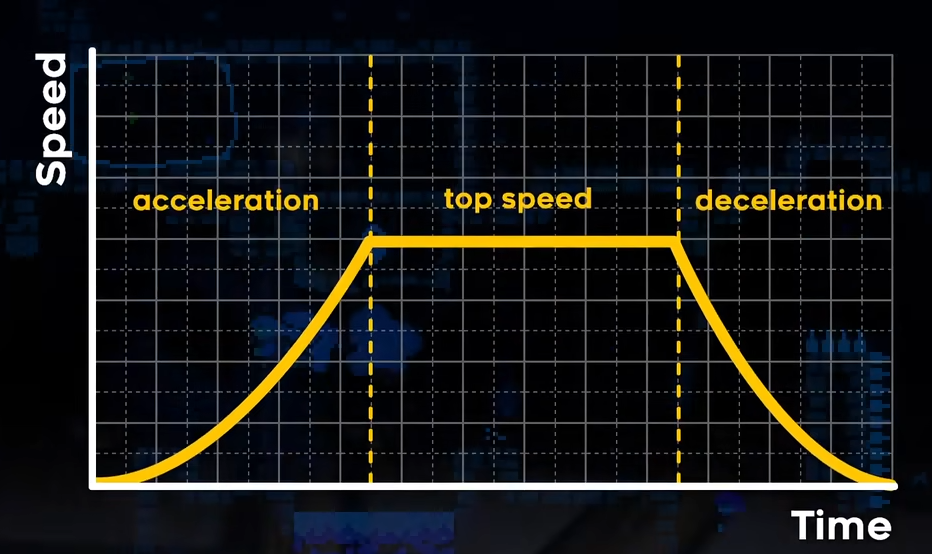
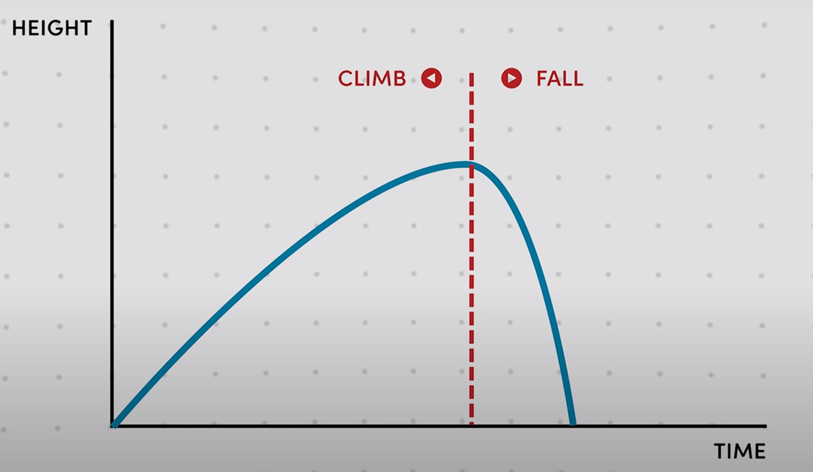

## Unity移动的几种方式
### Transform组件
Transform组件是Unity所有GameObject的共有组件。但是，使用Transform组件移动无法使用Unity自带的物理系统，从而无法检测碰撞等方法，因此一般不推荐使用。  
1. `Translate()`方法  
使用Transform的Translate函数可以在GameObject的本地坐标系下进行平移。Translate方法在游戏中可以用作物体移动，适用简单的移动方式，例如箱子在平面上自动移动等等。
2. 使用`position`属性  
`position`属性标识着物体的位置，变更该值可移动GameObject。
3. `MoveTowards()`方法  
使用Transform的`MoveTowards()`方法可以实现直线移动到目标位置。  
`MoveTowards()`方法对应的三个参数分别为（当前位置，目标位置，移动步长），同时，该方法能自动判定当前位置与目标位置的关系，从而自动判断是加上还是减去步长。以下是一个使用此方法的实例：
```
transform.position = Vector3.MoveTowards(transform.position, target.position, step);
```
### Rigidbody组件
Rigidbody组件是Unity官方提供的，使用物理学定律进行物体移动操作的组件。  
1. `AddForce()`方法  
使用`AddForce()`方法给刚体施加力来移动物体，想要朝哪个方向移动，就在哪个方向添加力。可以指定 [ForceMode](https://docs.unity.cn/cn/2019.4/ScriptReference/ForceMode.html)。下为示例：
```
Rigidbody.AddForce(m_NewForce, ForceMode.Impulse);
```
2. Velocity属性  
Velocity属性是Rigidbody组件自带的参数，用于控制物体的速度。我们可以直接设置该属性，以获得移动效果。

## 重要的速度曲线
### 移动速度曲线

如图所示，与物理规律相似，一个物体移动时，通常先加速再匀速，最后想要停止时减速。如果想要切换到相反的方向，则要先减速再反向加速。加速、减速的大小影响了角色操作手感，而反向加速的过程通常需要很大的加速度，从而保证不会有打滑的感觉发生。

### 跳跃速度曲线

跳跃速度曲线与物理规律所认识到的不一致。为了使操作者体验良好，下降沿加速度应快于上升沿。跳跃高度也应当有所控制，一般是物体高度的3~5倍是合适的。   
有些游戏会加入不同按键时间跳跃高度不同的机制。