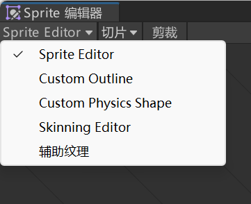
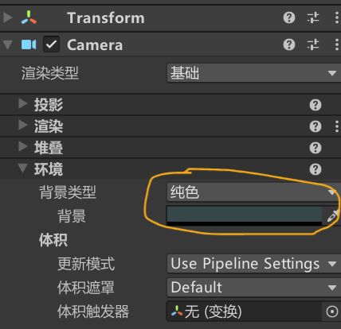

最近试了用Unity引擎开发一款简单的游戏，Unity引擎总体而言还算非常好用的，但某些设置经常忘记，在此记下，以备查询。  
以后我主要投入的方向是Unity和C#，传统前后端将不再支持。

<!--more-->

## 关于Unity对Asprite的支持
Unity支持通过`2D Aseprite Importer`对`.aseprite`或`.ase`文件直接导入，[但并不支持导入Tilemap文件](https://docs.unity3d.com/Packages/com.unity.2d.aseprite@1.1/manual/AsepriteFeatures.html#unsupported-features) 。如果需要导出，则需先在Aseprite中导出Tilemap专用的文件，再导入到Unity中。并且：  
1. 导入模式选择：Sprite Sheet，否则Sprite Editor无法将组件切割成不同部分；
2. 需要调节Pixel Per Unit，该值指的是单位长度能容纳多少像素，因此越低越大。
打开Sprite Editor进行切割。  
左上角如下图所示的选单中:  
a. Sprite Editor决定怎么导入素材；  
b. Custom Outline决定如何识别组件轮廓；  
c. Custom Physical Outline决定组件的物理轮廓（如碰撞体）。  

> 有时会遇见即使安装此拓展也无法导入的问题，如遇此问题，请升级组建的版本。

## 关于Animator与Animation组件的关系
Animation组件[已经弃用](https://docs.unity.cn/cn/2021.3/Manual/MecanimFAQ.html#:~:text=%E5%8A%A8%E7%94%BB%20(Animation)%20%E7%BB%84%E4%BB%B6%E5%92%8C%20Animator%20%E7%BB%84%E4%BB%B6%E4%B9%8B%E9%97%B4%E6%9C%89%E4%BD%95%E5%B7%AE%E5%BC%82%EF%BC%9F)，不推荐使用Animation管理动画，除非有兼容性相关的考量。

## 改变相机背景颜色
点击Main Camera->Camera组件->环境->背景类型，如图：


## 与IDE的向性
Unity目前支持Visual Studio、Visual Studio Code和Rider，其中对于前两者的实现均需要安装Visual Studio Editor（注意，VS Code也是一样，之前专供VS Code的Unity拓展[已被弃用](https://marketplace.visualstudio.com/items?itemName=VisualStudioToolsForUnity.vstuc#:~:text=Note%3A%20the%20Visual%20Studio%20Code%20Editor%20package%20is%20a%20legacy%20package%20from%20Unity%20that%20is%20not%20maintained%20anymore.)，而VS、VS Code方面只需要安装Unity相关拓展或环境即可。  
如果VS Code未能识别，则可能需要手动将其导入，并最好点一下`Regenerate Project Files`，尤其是项目中没有`.sln`文件时。

## Unity消息系统
SendMessage目前 [不推荐使用](https://docs.unity.cn/cn/2022.3/Manual/MessagingSystem.html#:~:text=%E6%96%B0%E7%9A%84%20UI%20%E7%B3%BB%E7%BB%9F%E4%BD%BF%E7%94%A8%E4%B8%80%E7%A7%8D%E6%B6%88%E6%81%AF%E7%B3%BB%E7%BB%9F%E6%9D%A5%E5%8F%96%E4%BB%A3%20SendMessage%E3%80%82)。一般采用新的，基于接口定义的方法在不同组件中传递消息。  
如果希望传递自定义消息，首先需要定义一个继承自`IEventSystemHandler`的接口，如下：
```
public interface ICustomMessageTarget : IEventSystemHandler
{
    // 可通过消息系统调用的函数
    void Message1();
    void Message2();
} 
```
之后，需要在`MonoBehaviour`（GameObject）中继承并实现此接口。如下：
> 不需要新建一个函数，只需要在脚本创建的那个类中加入`ICustomMessageTarget`即可。
```
public class CustomMessageTarget : MonoBehaviour, ICustomMessageTarget
{
    void Start()
    {
        ……
    }

    void Update()
    {
        ……
    }

    public void Message1()
    {
        Debug.Log ("Message 1 received");
    }

    public void Message2()
    {
        Debug.Log ("Message 2 received");
    }
}
```
调用此接口实现的方法时，需要使用`ExecuteEvents.Execute`方法。以下是一个例子：
```
ExecuteEvents.Execute<ICustomMessageTarget>(target, data, (handler, data) => handler.Message1());
```
其中，`ICustomMessageTarget`表示实现了该名称的接口的所有对象，`target`指脚本所在的目标对象，`data`指接口方法中所需要的数据，而最后一个参数是一个用lambda表达式书写的委托，`handler`代表当前的对象，而后面的`data`代表输入的数值。