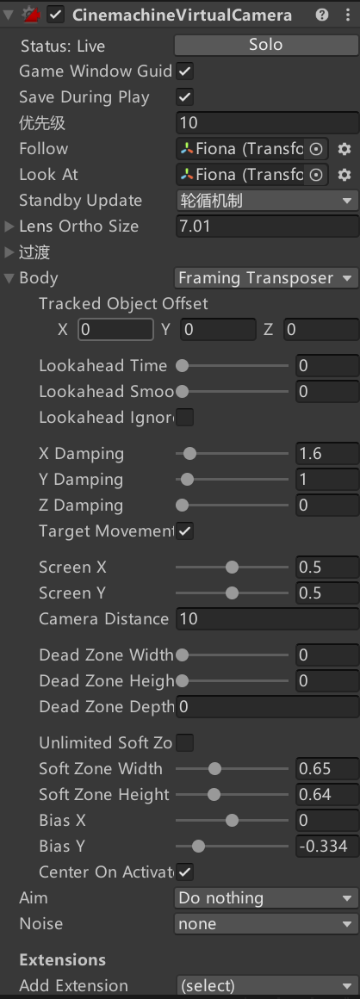

Cinemachine组件由官方出品，非常强大，可以省去我们很多精力在摄像机的运动上面。前提是弄清楚每一项的意义。
<!--more-->
对于2D项目，新建Cinemachine时，只需要使用`2D Camera`即可。新建之后，就可以看到相关的面板：  

- Lens Ortho Size，主要是控制摄像机缩放的大小；
- Body属性提供了下列算法来移动虚拟相机：
1. Do Nothing：不移动虚拟相机
2. Framing Transposer：在屏幕空间，保持相机和跟随目标的相对位置，可以设置缓动。
3. Hard Lock to Target：虚拟相机和跟随目标使用相同位置。
4. Orbital Transposer：相机和跟随目标的相对位置是可变的，还能接收用户的输入。常见于玩家控制的相机。
5. Tracked Dolly：相机沿着预先设置的轨道移动。
6. Transposer：相机和跟随目标的相对位置固定，可以设置缓动。
- Body下，主要是调节摄像机的相关参数，其中比较重要的参数有：
1. Lookahead 相关的参数：主要是根据目标的运动调整虚拟摄像机与跟随目标的偏移。
2. X/Y/Z Damping：相机尝试保持x/y/z轴偏移的响应速度。
3. Screen X/Y：目标的水平/垂直屏幕位置。摄像机移动以将跟踪对象定位在此处。
4. Dead Zone相关：当目标在此位置范围（死区）内时，请勿移动相机。
5. Soft Zone相关：当目标在此范围（软区）内时，水平移动相机以将目标框在死区。Damping特性会影响相机的移动速率。

> Dead zone：Cinemachine会将目标保持在这个区域，目标在这个区域时，镜头保持不动。  
Soft zone：如果目标进入这个区域，会触发相机的移动和旋转，将目标重新移回dead zone。这个过程可能很快，也可能很慢，取决于Damping属性设置。
6. Bias X/Y：将目标位置水平/垂直移离软区中心。（如果你需要将镜头向下移动一点，这会有用）
- Aim属性提供了下列算法来旋转相机对准Look At的目标：
1. Composer：将目标保持在相机镜头内，可以设置多种约束
2. Group Composer：将多个目标保持在相机镜头内
3. Do Nothing：不旋转相机
4. POV：根据用户的输入旋转相机
5. Same As Follow Target：将相机的旋转和跟随目标的旋转同步
6. Hard Look At：将Look At目标固定在镜头中心的位置。
- 主要的Extension：
1. Cinemachine Pixel Perfect：摄像机像素完美组件
2. Cinemachine Confiner 2D：可以设置相机在某个边界内移动，需要提供Composite/Polygon Collider 2D划定范围。