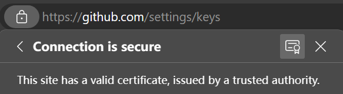

如题。
<!--more-->

### 1. 克隆Github时出现`SSL certificate problem: unable to get local issuer certificate`的解决方案：  

a. （推荐）更新Git，并在安装时选择使用系统自带的证书管理器。   
b. 下载Github证书到本地。打开GitHub网址，并点击图中高亮的图标：

在打开的界面中选择导出证书，格式可以是`.pem`和`.crt`等。然后运行如下命令：
```
git config --global http.sslCAInfo {{证书路径}}
```
或插入证书文件到：`{{安装文件夹}}\Git\mingw64\ssl\certs\`地址即可解决。注意，不要删除证书。  
c. （不建议）暂时关闭SSL认证，键入：
```
git config --global http.sslVerify false
```
        
### 2. git用户配置命令：
```
git config --global user.name "waser1999"
git config --global user.email waser1999@outlook.com
```
    
### 3. git支持GPG认证提交：  
a. 设置全局认证提交：
```
git config --global commit.gpgsign true
```
b. 将安装的GPG程序作为默认加密程序：
```
git config --global gpg.program {{gpg.exe文件路径}}
```
c. 查询GPG密钥ID：
```
gpg --list-secret-keys --keyid-format=long
```
d. 配置公钥：
```
git config --global user.signingkey 3AA5C34371567BD2
```

### 4. git配置VPN代理：  
a. 在系统设置的代理中找到本地代理IP地址  
b. 在终端中键入：  
```
git config --global http.proxy {{代理地址}}（HTTP协议）
git config --global https.proxy {{代理地址}}（HTTPS协议）
```
c. 取消代理：
```
git config --global --unset http.proxy
git config --global --unset https.proxy
```

### 5. git子模块submodule克隆  
a. 在一个git仓库中可以克隆仓库，但没有办法在该仓库中追踪克隆仓库的变化。若想追踪变化，可以将其用子模块克隆并追踪版本。  
b. 子模块的克隆，键入：
```
git submodule add <url> <repo_name>
```
其中，`repo_name`可以包含目录。  
c. 子模块更新和删除：
```
git submodule update --init --recursive
git rm --cached {{模块名}}
```

### 6. git大文件相关：  
a. 需要使用`git lfs`工具，只需一次初始化即可，在需要使用的仓库键入：
```
git lfs install
```
b. `git lfs`会自动选择需要跟踪的文件格式，如需手动调节，可以新建/打开`.gitattribute`文件，也可用终端键入：
```
git lfs track "*.svg"
```
c. 其余操作与普通git相同。  
d. `git lfs`不支持GitHub Pages。  
e. GitHub对普通git的限制：普通git网页上传文件限25M，通过git工具上传限100M。

### 7. 生成SSH密钥（Windows）：
在终端中输入以下命令， 之后按提示即可：
```
ssh-keygen -t rsa
```