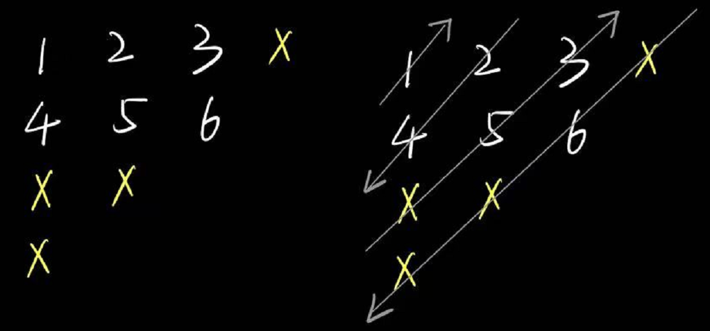

# 

### 题目： 
> (leetcode 498) 给你一个大小为 m x n 的矩阵 mat ，请以对角线遍历的顺序，用一个数组返回这个矩阵中的所有元素。（**注意：m是上往下，n是左往右**）  


<!--more-->
### 解法：  

我们应当注意到矩阵的如下性质：
- 矩阵的对角线数目是`m + n - 1`。
> 解释：矩阵的对角线可以沿着中心对角线（最长的那个）分为两个部分。左半部分的起始都是由行发出的，故有`m - 1`行个；右半部分同理有`n - 1`列个，再加上原来对角线的1个，总数即为`m + n - 1`个。
- 上行箭头的起始：
    1. 上三角：起始是从第i行，第0列，即`(i, 0)`；
    2. 下三角：起始是从最后一行，列数是线号数减去所有上三角线号数，即`(m - 1, i - m + 1)`
    > 你可以通过此图加深理解。将下三角的对角线理解为拓展的行，那么由于此时行列对称，其列数即为行数取模。
    
- 下行箭头的起始：
    1. 上三角：起始是从第i列，第0行，即`(0, i)`；
    2. 下三角：起始是从最后一列，行数是线号数减去所有上三角线号数，即`(i - n + 1, n - 1)`

### 代码：
```
class Solution {
    public int[] findDiagonalOrder(int[][] mat) {
        int m = mat.length;
        int n = mat[0].length;
        int[] result = new int[m * n];
        int mIndex = 0;
        int nIndex = 0;
        int index = 0;

        for (int line = 0; line < m + n - 1; line++) {
            //通过奇偶性区分上行、下行
            if(line % 2 == 0){
                //通过行数或列树区分对角线的区域
                if(line < m){
                    mIndex = line;
                    nIndex = 0;
                }else{
                    mIndex = m - 1;
                    nIndex = line - m + 1;
                }
                //遍历
                for (int i = mIndex, j = nIndex; i >= 0 && j < n; i--, j++) {
                    result[index++] = mat[i][j];
                }
                
            }else{
                if(line < n){
                    mIndex = 0;
                    nIndex = line;
                }else{
                    mIndex = line - n + 1;
                    nIndex = n - 1;
                }
                for (int i = mIndex, j = nIndex; i < m && j >= 0; i++, j--) {
                    result[index++] = mat[i][j];
                }
            }
        }

        return result;
    }
}
```