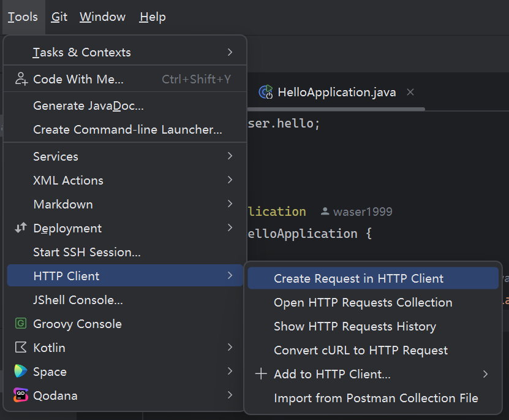
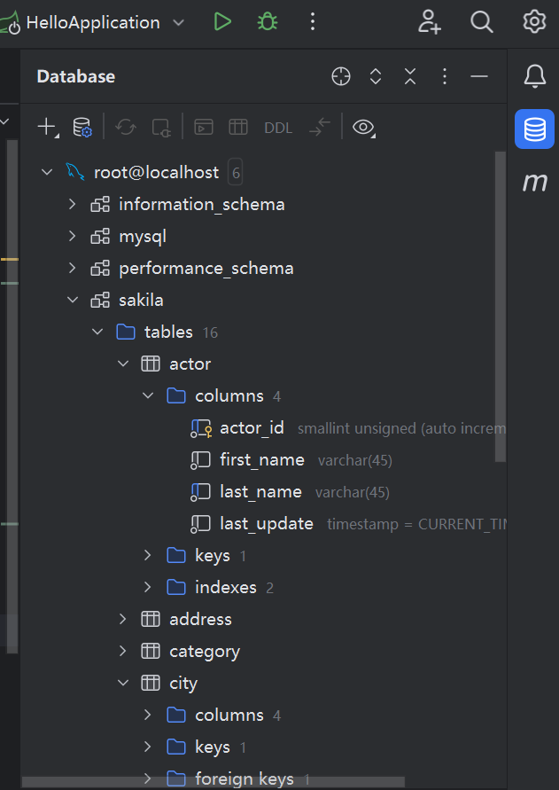
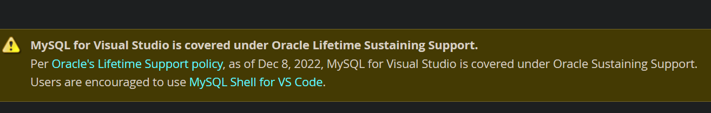

Jetbrains家的IDEA支持非常多的功能，而且都很好用，因此无需下载Navicat和Postman等工具也可以很好的满足一些需求。  
本文也记载了有关Mybatis与Mybatis Plus在使用`Entity`时的区别。  
<!--more-->
### 替代Postman工具直接在IDEA发起Post

你可以直接使用指向的功能替代Postman。打开界面后即可使用，IDEA贴心的给了实例用于参考。原理是通过识别`.http`文件进行测试。  
同样，[VS Code](https://zhuanlan.zhihu.com/p/382740857) 和 [Visual Studio](https://zhuanlan.zhihu.com/p/669413730)等其他IDE也能做到这一点，因此Postman工具并不必须。  

### 替代Navicat直接连接数据库

右侧状态栏直接可以配置数据库连接，试过了，非常好用！微软家的为了推广SQL Server，对MySQL的支持一言难尽，并且MySQL官方也撤回了对VS的支持。如果使用微软的体系，推荐 [HeidiSQL](https://www.heidisql.com/)。

### Mybatis与Mybatis Plus作为Entity时类字段区别
- Mybatis的Entity类中的属性名**必须**与表中的字段名完全一致。
- Mybatis Plus的Entity类中的属性名与字段名有如下规律：  
属性名：mybatisPlus -> 字段名：mybatis_plus
- 另注：配置Mybatis Plus时一定注意要安装依赖，详见官方文档中的 [添加依赖](https://baomidou.com/pages/226c21/#%E6%B7%BB%E5%8A%A0%E4%BE%9D%E8%B5%96)。